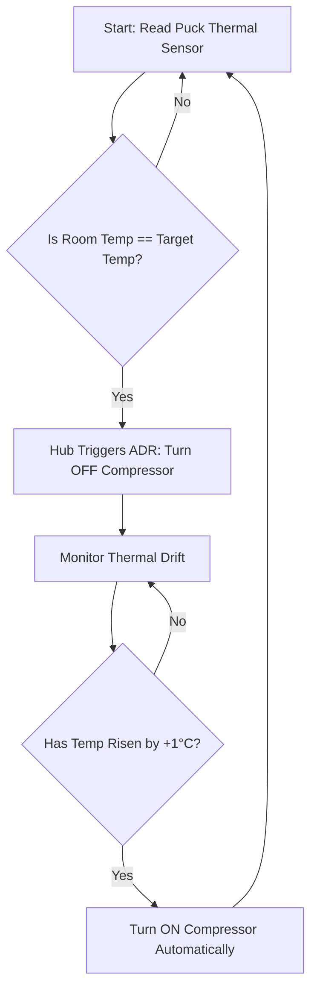

README.md
# Smart ADR Thermal Controller (Hub & Puck Ecosystem)

An IoT-enabled, hardware-retrofitted Automated Demand Response (ADR) system developed by *Flock Energy* in collaboration with *JVVNL* (Jaipur Vidyut Vitran Nigam Limited). This project converts legacy, non-smart, and inverter air conditioners into smart, grid-interactive appliances to optimize energy consumption and mitigate peak-load grid crises.

---

## ⚡ The Problem: Summer Peak Load Crises

During peak summer months, utility grids face immense structural stress. 
* *The Trigger:* Air conditioner adoption is growing at an aggressive rate of *10% to 15% every year*.
* *The Crisis:* Consider a power grid with a peak capacity threshold of *2,000,000 kW*. As temperatures rise, the surging simultaneous demand from AC units pushes electricity consumption far beyond this peak limit, resulting in localized transformer failures, grid instability, and rolling blackouts.

### Behavioral vs. Automated Demand Response
Utilities generally have two ways to manage these dangerous peak spikes:
1. *Behavioral Demand Response (BDR):* Relying on utilities to send alerts asking consumers to manually turn off their appliances. This is highly unreliable and suffers from low user compliance.
2. *Automated Demand Response (ADR) [This Solution]:* Utilizing dedicated hardware to automatically drop grid load directly at the appliance level during critical windows, without requiring human intervention and without sacrificing user comfort.

---

## 🚀 Key Advantages & Impact

* *Legacy & Inverter AC Retrofitting:* Instantly upgrades any standard, non-smart AC or inverter AC into an intelligent IoT device without requiring internal rewiring.
* *10% to 15% Electricity Savings:* Intelligently reduces overall power consumption by eliminating unnecessary compressor run-time.
* *App-Based Control:* Eliminates the need for a traditional infrared (IR) remote, allowing full AC management directly from a smartphone.

---

## 🛠️ System Architecture & Hardware Components

The system utilizes a split dual-device architecture to separate precise environmental sensing from power management and internet routing.
+------------------+                   +------------------+                   +------------------+
|    The Puck      |  Bridges via BLE  |     The Hub      |  Connects via Wi-Fi  |    Mobile App    |
| (Lithium Cell)   | ----------------> |  (Charging Port) | -------------------> |  & Cloud Server  |
|  Thermal Sensor  |                   |   Power Relay    |                   | (User Control)   |
+------------------+                   +------------------+                   +------------------+
### 1. The Puck (Sensor Module)
* **Power Source:** Internal Lithium cell battery (for long life and wire-free placement).
* **Placement:** Sticked directly onto or near the AC unit.
* **Function:** Acts as a high-precision digital thermal sensor monitoring ambient room temperature and output thresholds.
* **Connectivity:** Pairs with the Hub via **Bluetooth Low Energy (BLE)**.

### 2. The Hub (Gateway & Controller)
* **Power Source:** Plugged directly into a standard wall charging port/power outlet.
* **Function:** Acts as the central brain and local gateway. It receives live temperature data from the Puck and switches the AC's state.
* **Connectivity:** Built-in **Wi-Fi module** to connect to the local internet network and communicate with the cloud backend.

### 3. The Mobile Application
* Installs on the user's phone to complete the local network handshake.
* Allows the user to configure target temperatures, set up the Wi-Fi credentials, and override or monitor the AC remotely.

---

## ⚙️ Automated Demand Response (ADR) Control Logic

The device achieves its 10% to 15% energy efficiency by continuously executing a hysteresis loop based on a $1^\circ\text{C}$ thermal differential.

### The Algorithm Steps:
1. **Target Evaluation:** The Puck continuously tracks the room temperature ($T_{room}$) and transmits it to the Hub.
2. **Compressor Cut-off:** When the room cools down and the ambient room temperature matches the AC's target temperature ($T_{room} = T_{target}$), the Hub initiates an ADR event. It automatically cuts off power to the AC compressor while keeping the blower fan active to circulate the already-cooled air.
3. **Compressor Kick-in:** As the room naturally warms up, if the temperature rises by exactly $1^\circ\text{C}$ ($T_{room} \ge T_{target} + 1^\circ\text{C}$), the Hub automatically turns the compressor back on to restore cooling.

💻 Firmware & Software Setup
1. Connection & Initial Setup
Mount the Puck onto the AC chassis and plug the Hub into a nearby power outlet.
Download and open the dedicated mobile application.
Turn on Bluetooth on your phone to discover the Hub.
Pass your local Wi-Fi network credentials through the app to establish an internet connection for the Hub.
The Hub and Puck will automatically handshake over BLE.
2. Development Prerequisites (For Developers)
To modify or flash firmware to the Hub or Puck microcontrollers:
IDE: Arduino IDE or VS Code with PlatformIO.
Core Libraries: * BLEDevice / BLERemoteCharacteristic (for Hub-Puck communication)
WiFi / PubSubClient (for MQTT cloud syncing)
Low-power sleep libraries for the Puck's Lithium battery optimization.
👥 Authors & Acknowledgments
Flock Energy — Core Product Development, Patent, & Hardware Manufacturing.
JVVNL (Jaipur Vidyut Vitran Nigam Limited) — Utility Partner providing infrastructure insights and Demand Response frameworks.
* **Ravi Panwar** — Engineering Intern.
